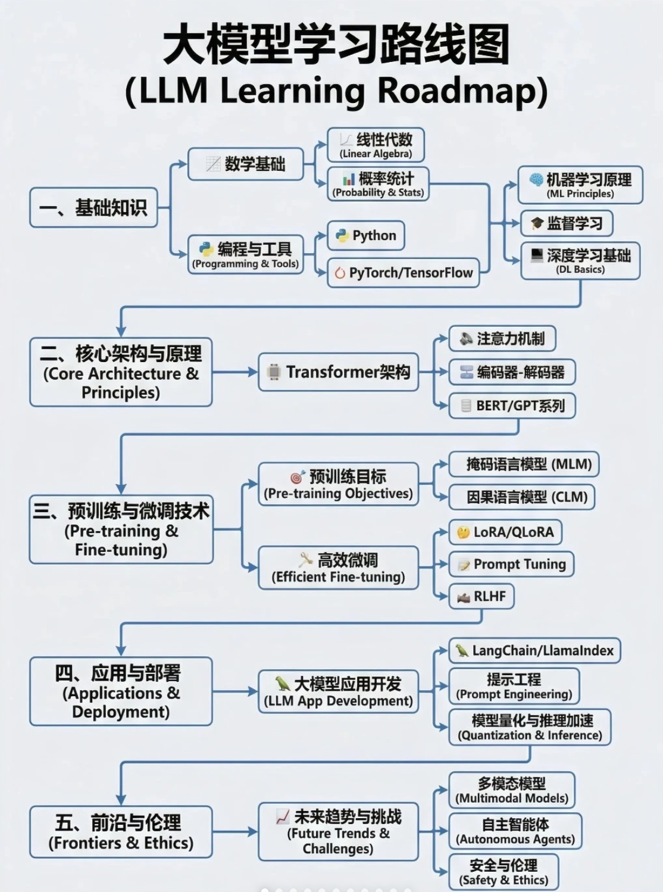
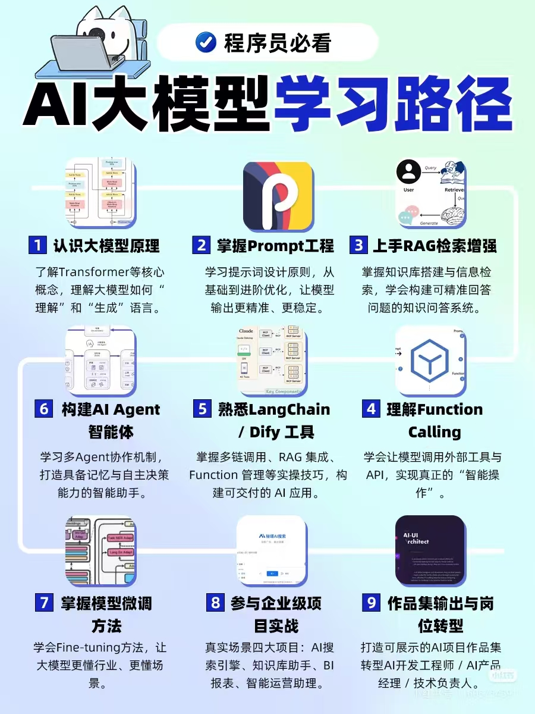
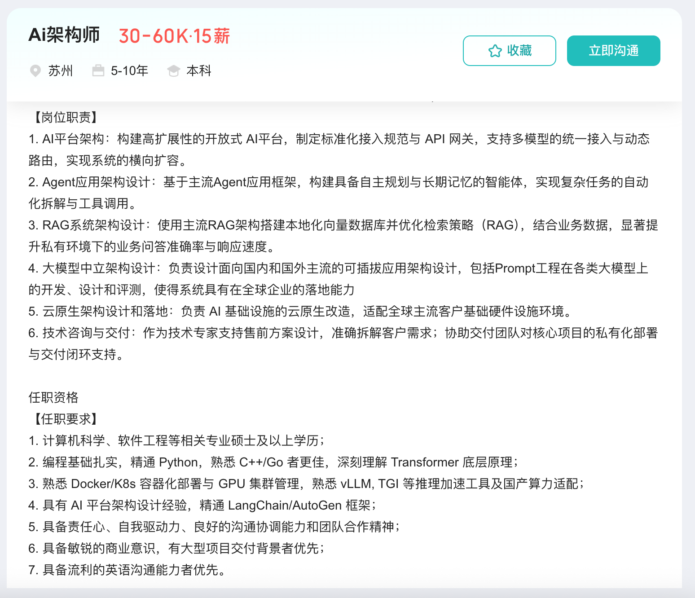
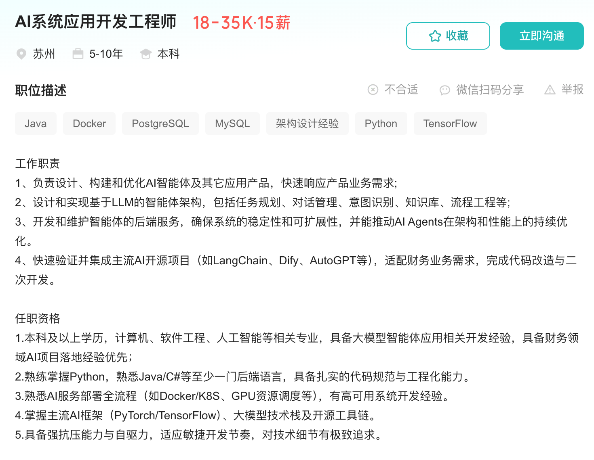
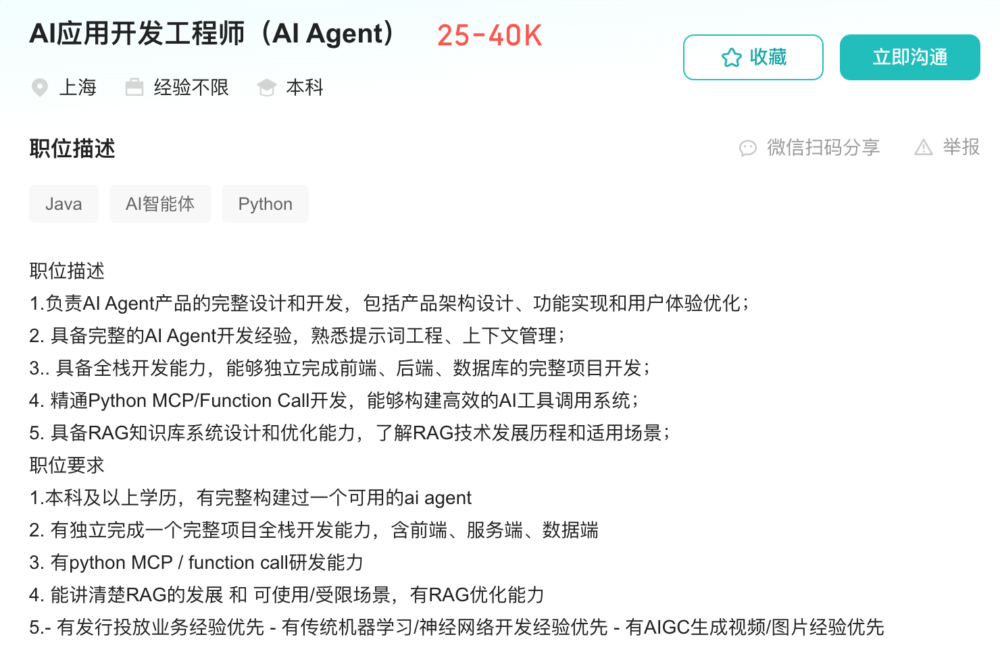
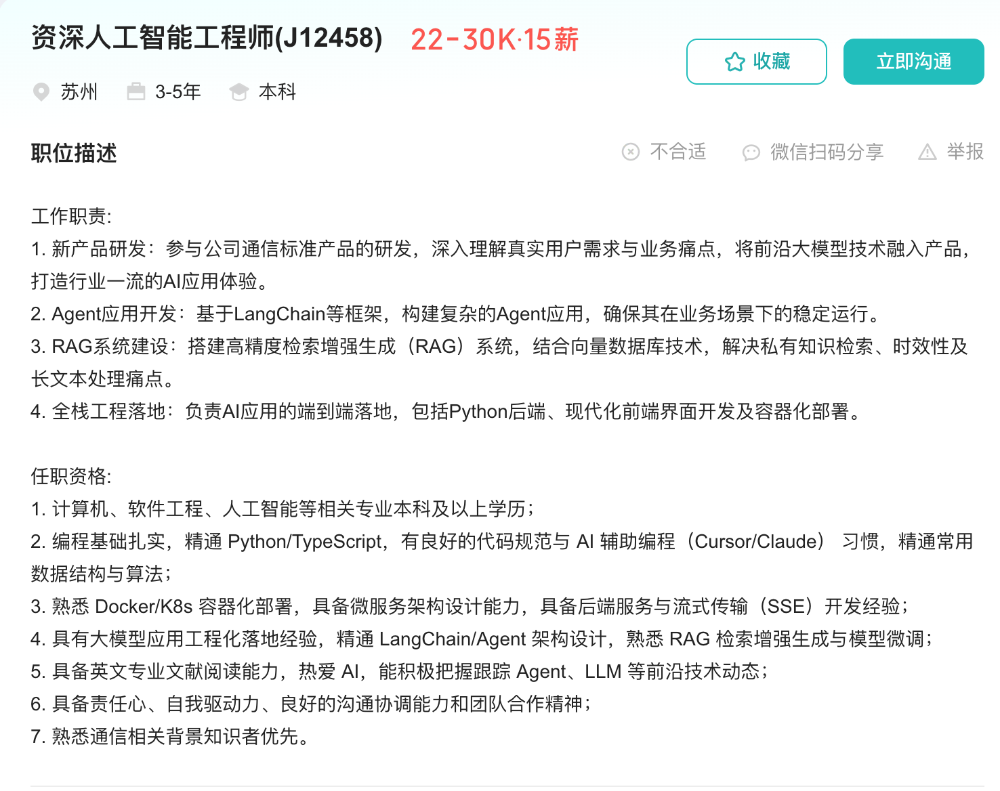

# AI

Status: In progress

<aside>
💡

结构思维：将大模型的根、树干建立起来，再填充枝叶

培养核心能力：AI落地

</aside>

Link:

[https://github.com/ninehills/blog/issues/97](https://github.com/ninehills/blog/issues/97)

[https://www.latent.space/p/2025-papers#§section-prompting-icl-and-chain-of-thought](https://www.latent.space/p/2025-papers#%C2%A7section-prompting-icl-and-chain-of-thought)

[https://github.com/zyf-ngu/Qmatter](https://github.com/zyf-ngu/Qmatter)

Videos:

https://www.bilibili.com/video/BV1atCRYsE7x/?spm_id_from=333.337.search-card.all.click&vd_source=f91bc4f6aba4ddac5ad93af18bf61bcc

[Deep Dive into LLMs like ChatGPT: Andrej Karpathy](AI/Deep%20Dive%20into%20LLMs%20like%20ChatGPT%20Andrej%20Karpathy%202e1b6d0f20d980958363e37f38c16911.md)

[**ChatGPT Prompt Engineering for Developers**](AI/ChatGPT%20Prompt%20Engineering%20for%20Developers%202e0b6d0f20d980d1aa8ec3fa79d7733d.md)

https://space.bilibili.com/1815948385/upload/video

Tools:

- Claude Code
    
    https://anthropic.skilljar.com/claude-code-in-action
    
    https://learn.deeplearning.ai/courses/claude-code-a-highly-agentic-coding-assistant/lesson/66b35/introduction
    
    https://www.bilibili.com/video/BV14rzQB9EJj/?spm_id_from=333.337.search-card.all.click&vd_source=f91bc4f6aba4ddac5ad93af18bf61bcc
    
    https://www.youtube.com/watch?v=Ffh9OeJ7yxw
    
- MCP
    
    https://www.bilibili.com/video/BV1uronYREWR/
    
- Skills

Todos:

- [ ]  Agent Learn
    - [ ]  Build a LLM from Scratch
    - [ ]  MiniMind 补 LLM 基础
    - [ ]  RAG from Scratch 入门 RAG
    - [ ]  [https://learn.deeplearning.ai/courses/agentic-ai/lesson/pu5xbv/welcome](https://learn.deeplearning.ai/courses/agentic-ai/lesson/pu5xbv/welcome)!
    - [ ]  Agentic Design Patterns
    - [ ]  Hello-Agents 建立 Agent 整体认知
    - [ ]  https://learn.shareai.run/en/s01/
    - [ ]  OpenCode 学 code agent 的工程实现
    - [ ]  OpenClaw 学更泛化的 agent platform 思路
    - [ ]  持续跟 OpenAI / Anthropic 的博客
- [ ]  Agent Project
    - [ ]  AI Agent-LLMOps
    - [ ]  使用结构化思维开发Learning Agent
    - [ ]  面试Agent
    - [ ]  职业规划Agent
    - [ ]  语言学习Agent
    - [ ]  平台：链接个体和公司，类似接单平台，但更宏大